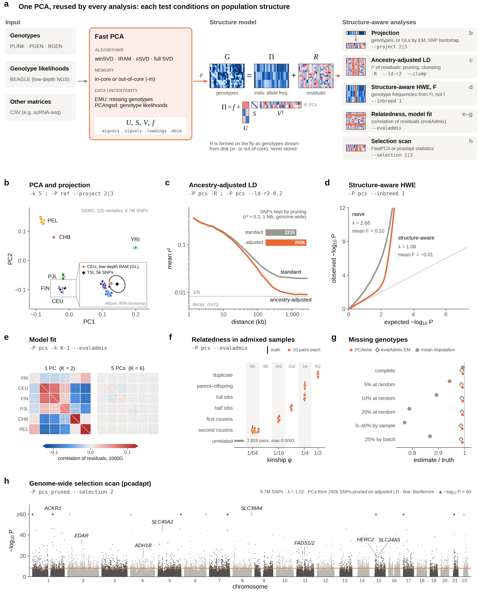

# Principal Component Analysis All in One (v0.8.0-pre)

<a href="https://github.com/Zilong-Li/PCAone/actions/workflows/linux.yml"></a>
<a href="https://github.com/Zilong-Li/PCAone/actions/workflows/mac.yml"></a>
<a href="https://github.com/Zilong-Li/PCAone/releases/latest"></a>
<a href="https://zilong-li.github.io/PCAone/"></a>

PCAone is a fast, memory-efficient C++ tool for principal component analysis
of large datasets, with in-core and out-of-core algorithms.

- **Inputs:** PLINK BED, PLINK2 PGEN, BEAGLE genotype likelihoods, zstd-compressed CSV, and limited BGEN support.
- **PCA:** window-based randomized SVD (default), single-pass randomized SVD, IRAM, and exact sample-GRM eigendecomposition.
- **Genetics:** EMU/PCAngsd, projection, selection scans, HWE tests, per-sample inbreeding coefficients, ancestry-adjusted LD pruning and clumping, and evalAdmix residual correlations.

[Documentation](https://zilong-li.github.io/PCAone/) · [Changelog and migration notes](docs/changelog.md) · [R package](https://github.com/Zilong-Li/PCAoneR)



*One PCA, reused by structure-aware analyses. (a) PCAone saves U, S, V and the allele frequencies f; every downstream analysis reads them back with `-P/--USV`. (b–h) Examples on 1000 Genomes samples and on admixed samples with known relatedness.*

## Installation

Install with [Bioconda](https://anaconda.org/bioconda/pcaone):

```shell
conda install -c conda-forge -c bioconda pcaone
PCAone --help
```

Or download a Linux/macOS binary from the [releases page](https://github.com/Zilong-Li/PCAone/releases).

To build from source, use a C++17 compiler, GNU make, and zlib. On macOS,
install OpenMP first with `brew install libomp`.

```shell
git clone https://github.com/Zilong-Li/PCAone.git
cd PCAone
make -j4
./PCAone --help
```

See [Installation](docs/installation.md) for MKL and OpenBLAS builds.

## Quick start

```shell
# PLINK BED/BIM/FAM: compute 10 PCs
PCAone -b data -k 10 -o pcs

# PLINK2 PGEN/PVAR/PSAM: use dosages when available
PCAone -p data -k 10 -o pcs

# Out-of-core PCA with a 2 GB memory setting
PCAone -b data -k 10 -m 2 -o pcs
```

Replace `data` with your input prefix. Add `--hardcall` to use PGEN hard calls.
`-m` sizes the working blocks, so total RAM can exceed it. BGEN support is
limited; convert to PGEN for production workflows.

| Output      | Contents                                       |
| ----------- | ---------------------------------------------- |
| `.eigvecs`  | PC coordinates: samples × PCs                  |
| `.eigvecs2` | The same with FID/IID columns and a header     |
| `.eigvals`  | Eigenvalues                                    |
| `.sigvals`  | Singular values and scaling metadata           |
| `.loadings` | Feature loadings, requested with `--printv`    |
| `.mbim`     | Variant metadata and frequencies with loadings |
| `.log`      | Run settings and progress                      |

For a small sample count and many variants, use `--svd 3` for exact PCA.
It needs an N × N sample GRM in memory and does not support EM-PCA.
Use the default `--svd 2` for large datasets.

## Common workflows

```shell
# Ancestry-adjusted LD pruning with the first 3 reference PCs
PCAone -b reference -P ref -k 3 --ld-r2 0.2 -o pruned

# Build a reference and project new samples
PCAone -b reference -k 10 --printv -o ref
PCAone -b target -P ref --project 2 -o projected

# PCA for count data in zstd-compressed CSV
PCAone -c counts.csv.zst -k 10 --scale 2 -S -o counts
```

Projection requires compatible genome builds and alleles. LD requires the
same samples in the same order as the reference PCA. Analyses using `-P`
use every reference PC unless `-k` selects the leading PCs.

## Documentation

The full documentation is at **[zilong-li.github.io/PCAone](https://zilong-li.github.io/PCAone/)**; its
Markdown sources are in [`docs/`](https://github.com/Zilong-Li/PCAone/tree/main/docs).

- [Installation](docs/installation.md): binaries, Bioconda, and builds with MKL or OpenBLAS.
- User guide: [options](docs/guide/options.md), [PCA methods and memory](docs/guide/pca.md),
  [input and output](docs/guide/input-output.md), [projection](docs/guide/projection.md),
  [selection scans](docs/guide/selection.md), [HWE and inbreeding](docs/guide/hwe.md),
  [evalAdmix](docs/guide/evaladmix.md), and [ancestry-adjusted LD](docs/guide/ld.md).
- [Tutorials](docs/tutorials.md) on the example datasets.
- Methods: [ancestry-adjusted LD](docs/ld-ancestry-adjusted.md) and [evalAdmix](docs/evaladmix.md).
- [Reproducing the benchmark](docs/reproducing-the-benchmark.md).
- [Plotting](docs/plotting.md): SNP loadings along the genome and LD decay curves.
- [Changelog](docs/changelog.md): release history, result changes, and legacy command migration.

Run `PCAone --help` for all options, or generate a man page:

```shell
PCAone --groff > pcaone.1
man ./pcaone.1
```

## Citation

Please cite [Fast and accurate out-of-core PCA framework for large scale biobank data](https://genome.cshlp.org/content/early/2023/10/05/gr.277525.122)
when using PCAone. For specific analyses, also cite:

- EMU: [Large-scale inference of population structure in presence of missingness using PCA](https://academic.oup.com/bioinformatics/article/37/13/1868/6103565).
- PCAngsd: [Inferring Population Structure and Admixture Proportions in Low-Depth NGS Data](https://www.genetics.org/content/210/2/719).
- Ancestry-adjusted LD: [Measuring linkage disequilibrium and improvement of pruning and clumping in structured populations](https://doi.org/10.1093/genetics/iyaf009).

## Contributing and acknowledgements

Issues and contributions are welcome. PCAone uses [Eigen](https://eigen.tuxfamily.org/),
[Spectra](https://github.com/yixuan/spectra), and a BGEN reader adapted from [jeremymcrae/bgen](https://github.com/jeremymcrae/bgen);
its EMU and PCAngsd implementations build on [Jonas Meisner's packages](https://github.com/Rosemeis).
