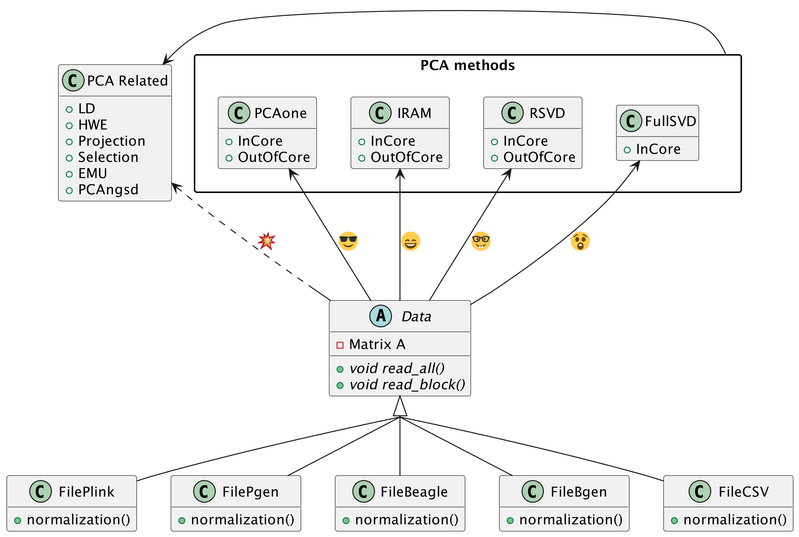

#+TITLE: Principal Component Analysis All in One (v0.7.1)
#+subtitle: Version 0.7.1
#+author: Zilong Li 
#+email: zilong.dk@gmail.com
#+options: toc:2 num:nil email:t -:nil ^:nil
#+latex_compiler: xelatex
#+latex_class: article
#+latex_class_options: [a4paper, 11pt]
#+latex_header: \usepackage[margin=0.9in,bmargin=1.0in,tmargin=1.0in]{geometry}
#+latex_header: \usepackage{amssymb}
#+latex_header: \usepackage{adjustbox}
#+latex_header: \usepackage{upquote}
#+latex_header: \hypersetup{colorlinks=true, linkcolor=blue}
#+latex: \clearpage

[[https://github.com/Zilong-Li/PCAone/actions/workflows/linux.yml/badge.svg]]
[[https://github.com/Zilong-Li/PCAone/actions/workflows/mac.yml/badge.svg]]
[[https://bioconda.github.io/recipes/pcaone/README.html][https://img.shields.io/badge/install%20with-bioconda-brightgreen.svg?style=flat]]
[[https://github.com/Zilong-Li/PCAone/releases/latest][https://img.shields.io/github/v/release/Zilong-Li/PCAone.svg]]
[[https://anaconda.org/bioconda/pcaone/badges/downloads.svg]]

* Introduction

PCAone is a fast and memory efficient PCA tool implemented in C++ aiming at
providing comprehensive features and algorithms for different scenarios.
PCAone implements 3 fast PCA algorithms for finding the top eigenvectors of
large datasets, which are [[https://en.wikipedia.org/wiki/Arnoldi_iteration][Implicitly Restarted Arnoldi Method]] (IRAM, --svd 0),
[[https://www.ijcai.org/proceedings/2017/468][single pass Randomized SVD]] with power iteration scheme (sSVD, --svd 1,
Algorithm1 in paper) and *our proposed window based RSVD* (winSVD, --svd 2,
Algorithm2 in paper). All have both in-core and out-of-core implementation.
Addtionally, Full SVD/Eigendecomposition (--svd 3) is supported via in-core mode only. Also,
check out the [[https://github.com/Zilong-Li/PCAoneR][R]] package here. PCAone supports multiple different input
formats, such as [[https://www.cog-genomics.org/plink/1.9/formats#bed][PLINK BED]], [[https://www.cog-genomics.org/plink/2.0/input#pgen][PLINK2 PGEN]], [[https://www.well.ox.ac.uk/~gav/bgen_format][BGEN]], [[http://www.popgen.dk/angsd/index.php/Input#Beagle_format][Beagle]] genetic data formats and a general comma
separated CSV format for other data, such as scRNAs and bulk RNAs. For
genetics data, PCAone also implements [[https://github.com/Rosemeis/emu][EMU]] and [[https://github.com/Rosemeis/pcangsd][PCAngsd]] algorithm for data with
missingness and uncertainty. The PDF manual can be downloaded [[https://github.com/Zilong-Li/PCAone/blob/main/PCAone.pdf][here]].

* Table of Contents :toc:quote:noexport:
#+BEGIN_QUOTE
- [[#introduction][Introduction]]
- [[#features][Features]]
- [[#whats-new-in-v070][What's new in v0.7.0]]
- [[#cite-the-work][Cite the work]]
- [[#quick-start][Quick start]]
- [[#installation][Installation]]
  - [[#download-compiled-binary][Download compiled binary]]
  - [[#via-conda][Via Conda]]
  - [[#build-from-source][Build from source]]
- [[#documentation][Documentation]]
  - [[#options][Options]]
  - [[#which-svd-method-to-use][Which SVD method to use]]
  - [[#input-formats][Input formats]]
  - [[#output-files][Output files]]
  - [[#performance-and-memory][Performance and memory]]
  - [[#data-normalization][Data Normalization]]
  - [[#projection][Projection]]
  - [[#genome-wide-selection-scan][Genome-wide selection scan]]
  - [[#hwe-accounting-for-population-structure][HWE accounting for population structure]]
  - [[#ancestry-adjusted-ld-matrix][Ancestry adjusted LD matrix]]
  - [[#report-ld-statistics][Report LD statistics]]
  - [[#prunning-based-on-ancestry-adjusted-ld][Prunning based on ancestry adjusted LD]]
  - [[#clumping-based-on-ancestry-adjusted-ld][Clumping based on ancestry adjusted LD]]
- [[#more-tutorials][More tutorials]]
  - [[#genotype-data-plink][Genotype data (PLINK)]]
  - [[#plink2-pgen-input][PLINK2 PGEN input]]
  - [[#bgen-input-limited-support][BGEN input (limited support)]]
  - [[#single-cell-rna-seq-data-csv][Single cell RNA-seq data (CSV)]]
- [[#acknowledgements][Acknowledgements]]
- [[#contributing][Contributing]]
#+END_QUOTE

* Features

See [[file:CHANGELOG.org][change log]] here.

- Has both Implicitly Restarted Arnoldi Method (IRAM) and Randomized SVD (RSVD) with *out-of-core* implementation.
- Implements our new fast window based Randomized SVD algorithm for tera-scale dataset.
- Quite fast with multi-threading support using high performance library [[https://software.intel.com/content/www/us/en/develop/tools/oneapi/components/onemkl.html#gs.8jsfgz][MKL]] or [[https://www.openblas.net/][OpenBLAS]] as backend.
- Supports the [[https://www.cog-genomics.org/plink/1.9/formats#bed][PLINK]], [[https://www.well.ox.ac.uk/~gav/bgen_format][BGEN]], [[http://www.popgen.dk/angsd/index.php/Input#Beagle_format][Beagle]] genetic data formats.
- Supports [[https://www.cog-genomics.org/plink/2.0/input#pgen][PLINK2 PGEN]] input via =--pgen=, using dosages by default and hard calls with =--hardcall=.
- Supports the comma separated CSV format with integer/float entries for single cell (or bulk) RNA-seq data compressed by [[https://github.com/facebook/zstd][zstd]].
- Supports [[https://github.com/Rosemeis/emu][EMU]] algorithm for scenario with large proportion of missingness.
- Supports [[https://github.com/Rosemeis/pcangsd][PCAngsd]] algorithm for low coverage sequencing scenario with genotype likelihood as input.
- Novel [[https://www.biorxiv.org/content/10.1101/2024.05.02.592187v1][LD]] prunning and clumping method that accounts for population structure in the data.
- Projection support for data with missingness.
- Projection from BEAGLE genotype likelihoods onto a reference space via =--project 3=.
- HWE test taking population structure into account.

* What's new in v0.7.0

- Added PLINK2 =PGEN= input support with =--pgen= for PCA workflows.
- =PGEN= reads dosages when available, and can be forced to use hard calls with =--hardcall=.
- Added genotype-likelihood aware projection for =BEAGLE= input with =--project 3=.
- Projection now matches overlapping markers against the reference =.mbim= and corrects flipped alleles when needed.
- Added genome-wide selection scans via =--selection 1= (Galinsky/FastPCA) and =--selection 2= (pcadapt).
- Bug fixes for projection with missing data
- Fast Eigendecomposition when =N<<M= with =-d 3=

* Cite the work

- If you use PCAone, please first cite our paper on genome reseach [[https://genome.cshlp.org/content/early/2023/10/05/gr.277525.122][Fast and accurate out-of-core PCA framework for large scale biobank data]].

- If using the EMU algorithm, please also cite [[https://academic.oup.com/bioinformatics/article/37/13/1868/6103565][Large-scale inference of population structure in presence of missingness using PCA]].

- If using the PCAngsd algorithm, please also cite [[https://www.genetics.org/content/210/2/719][Inferring Population Structure and Admixture Proportions in Low-Depth NGS Data]].
  
- If using the ancestry ajusted LD statistics for pruning and clumping, please also cite [[https://doi.org/10.1093/genetics/iyaf009][Measuring linkage disequilibrium and improvement of pruning and clumping in structured populations]].

* Quick start

#+begin_src shell
pkg=https://github.com/Zilong-Li/PCAone/releases/latest/download/PCAone-avx2-Linux.zip
wget $pkg && unzip -o PCAone-avx2-Linux.zip
wget http://popgen.dk/zilong/datahub/pca/example.tar.gz
tar -xzf example.tar.gz && rm -f example.tar.gz
./PCAone -b example/plink
R -s -e 'd=read.table("pcaone.eigvecs2", h=F);
plot(d[,1:2+2], col=factor(d[,1]), xlab="PC1", ylab="PC2");
legend("topleft", legend=levels(factor(d[,1])), col=1:4, pch = 21, cex=1.2);'
#+end_src

You will find these files in current directory.

#+begin_src shell
.
├── PCAone            # program
├── Rplots.pdf        # pca plot
├── example           # folder of example data
├── pcaone.eigvals    # eigenvalues
├── pcaone.eigvecs    # eigenvectors, the PCs you need to plot
├── pcaone.eigvecs2   # eigenvectors with header line
└── pcaone.log        # log file
#+end_src

\newpage

* Installation

There are 3 ways to install PCAone.

** Download compiled binary

There are compiled binaries provided for both Linux and Mac platform. Check
[[https://github.com/Zilong-Li/PCAone/releases][the releases page]] to download one.

#+begin_src shell
pkg=https://github.com/Zilong-Li/PCAone/releases/latest/download/PCAone-Linux.zip
wget $pkg || curl -LO $pkg
unzip -o PCAone-Linux.zip
#+end_src

** Via Conda

PCAone is also available from [[https://anaconda.org/bioconda/pcaone][bioconda]].

#+begin_src sh
conda config --add channels bioconda
conda install pcaone
PCAone --help
#+end_src

** Build from source

PCAone has been tested on both =Linux= and =MacOS= system. To build PCAone from the source code, the following dependencies are required:

- GCC/Clang compiler with C++17 support
- GNU make
- zlib

On Linux, we *recommend* building the software from source with MKL as backend to maximize the performance.

*** With MKL or OpenBLAS as backend

Build PCAone dynamically with MKL can maximize the performance for large
dataset particularly, because the faster threading layer =libiomp5= will be
linked at runtime. There are two options to obtain MKL library:

- download =MKL= from [[https://www.intel.com/content/www/us/en/developer/tools/oneapi/onemkl.html][the website]]

After having =MKL= installed, find the =MKL= root path and replace the path below with your own.

#+begin_src shell
make -j4 MKLROOT=/opt/intel/oneapi/mkl/latest  ONEAPI_COMPILER=/opt/intel/oneapi/compiler/latest
#+end_src

Alternatively, for advanced user, modify variables directly in =Makefile= and run =make= to use MKL or OpenBlas as backend.

- install =MKL= by conda

#+begin_src shell
conda install -c conda-forge -c anaconda -y mkl mkl-include intel-openmp
git clone https://github.com/Zilong-Li/PCAone.git
cd PCAone
# if mkl is installed by conda then use ${CONDA_PREFIX} as mklroot
make -j4 MKLROOT=${CONDA_PREFIX}
./PCAone -h
#+end_src

*** Without MKL or OpenBLAS dependency

If you don't want any optimized math library as backend, just run:

#+begin_src shell
git clone https://github.com/Zilong-Li/PCAone.git
cd PCAone
make -j4
./PCAone -h
#+end_src

*** For MacOS users, check out the [[https://github.com/Zilong-Li/PCAone/blob/dev/.github/workflows/mac.yml#L21][mac workflow]].

#+begin_src shell
brew install libomp
make -j4
#+end_src

\newpage

* Documentation
** Options

Run =PCAone --groff > pcaone.1 && man ./pcaone.1= or =PCAone --help= to read the manual. Here are common options.

#+begin_src example
General options:
  -h, --help                     print all options including hidden advanced options
  -m, --memory arg (=0)          RAM usage in GB unit for out-of-core mode. default is in-core mode
  -n, --threads arg (=12)        the number of threads to be used
  -v, --verbose arg (=1)         verbosity level for logs. Options are
                                 0: silent, no messages on screen;
                                 1: concise messages to screen;
                                 2: more verbose information;
                                 3: enable debug information.

PCA algorithms:
  -d, --svd arg (=2)             SVD method to be applied. default 2 is recommended for big data. Options are
                                 0: the Implicitly Restarted Arnoldi Method (IRAM);
                                 1: the Yu's single-pass Randomized SVD with power iterations;
                                 2: the accurate window-based Randomized SVD method (PCAone);
                                 3: the full Singular Value Decomposition.
  -k, --pc arg (=10)             top k principal components (PCs) to be calculated
  -C, --scale arg (=-9)          do normalization or scaling for input file. Options are
                                 -9: standardize genetic data by sqrt(ploidy*f*(1-f));
                                  0: do nothing and proceed to SVD;
                                  1: do direct standardization, as the scale(x, center=TRUE, scale=TRUE) function in R;
                                  2: do first count per median log transformation (CPMED), then standardization;
                                  3: do first log1p transformation, then standardization;
                                  4: do first relative counts, then standardization.
  --maxp arg (=20)               maximum number of power iterations for RSVD algorithm.
  -S, --no-shuffle               do not shuffle columns of data for --svd 2 (if not locally correlated).
  --seed arg (=112)              seeds for reproducing results.
  --emu                          use EMU algorithm for genotype input with missingness.
  --pcangsd                      use PCAngsd algorithm for genotype likelihood input.

Input options:
  -b, --bfile arg                prefix of PLINK .bed/.bim/.fam files.
  -p, --pgen arg                 prefix of PLINK2 .pgen/.pvar/.psam files.
  -B, --binary arg               path of binary file.
  -c, --csv arg                  path of comma seperated CSV file compressed by zstd.
  -g, --bgen arg                 path of BGEN file compressed by gzip/zstd.
  -G, --beagle arg               path of BEAGLE file compressed by gzip.
  -F, --match-bim arg            the .mbim file to be matched, where the 7th column is allele frequency.
  -P, --USV arg                  prefix of PCAone .eigvecs/.eigvals/.loadings/.mbim.

Output options:
  -o, --out arg (=pcaone)        prefix of output files. default [pcaone].
  -V, --printv                   output the right eigenvectors with suffix .loadings.
  -D, --ld                       output a binary matrix for downstream LD related analysis.
  -R, --print-r2                 print LD R2 to *.ld.gz file for pairwise SNPs within a window controlled by --ld-bp.

Misc options:
  --maf arg (=0)                 exclude variants with MAF lower than this value
  --project arg (=0)             project the new samples onto the existing PCs. Options are
                                 0: disabled;
                                 1: by multiplying the loadings with mean imputation for missing genotypes;
                                 2: by solving the least squares system Vx=g. skip sites with missingness;
                                 3: by EM to account for genotype uncertainty (BEAGLE input).
  --inbreed arg (=0)             compute the inbreeding coefficient accounting for population structure. Options are
                                 0: disabled;
                                 1: compute per-site inbreeding coefficient and HWE test.
  --selection arg (=0)           compute selection statistics. Options are
                                 0: disabled;
                                 1: perform genome-wide selection scan using Galinsky et al method;
                                 2: perform genome-wide selection scan using pcadapt method.
  --ld-r2 arg (=0)               R2 cutoff for LD-based pruning (usually 0.2).
  --ld-bp arg (=1000000)         physical distance threshold in bases for LD window.
  --ld-stats arg (=0)            statistics to compute LD R2 for pairwise SNPs. Options are
                                 0: the ancestry adjusted, i.e. correlation between residuals;
                                 1: the standard, i.e. correlation between two alleles.
  --clump arg                    assoc-like file with target variants and pvalues for clumping.
  --clump-names arg (=CHR,BP,P)  column names in assoc-like file for locating chr, pos and pvalue.
  --clump-p1 arg (=0.0001)       significance threshold for index SNPs.
  --clump-p2 arg (=0.01)         secondary significance threshold for clumped SNPs.
  --clump-r2 arg (=0.5)          r2 cutoff for LD-based clumping.
  --clump-bp arg (=250000)       physical distance threshold in bases for clumping.
#+end_src

\newpage

** Which SVD method to use

This depends on your datasets, particularlly the relationship between number
of samples (=N=) and the number of variants / features (=M=) and the top PCs
(=k=). Here is an overview and the recommendation.

|-----------------+-------------------------+-----------+--------------------------------|
| Method          | Scenario                | Accuracy  | Speed                          |
|-----------------+-------------------------+-----------+--------------------------------|
| Full SVD (-d 3) | full variance explained | Exact     | slow for big =N= and =M=           |
| winSVD (-d 2)   | =M or N >> 500000=        | Very high | fast (only 7 iterations used)  |
| IRAM (-d 0)     | speed insensitive       | Very high | denpends on =N= and # iterations |
| sSVD (-d 1)     | accuracy insensitive    | High      | depends on # iterations        |
|-----------------+-------------------------+-----------+--------------------------------|

** Input formats

PCAone is designed to be extensible to accept many different formats.
Currently, PCAone can work with SNP major genetic formats to study
population structure. such as [[https://www.cog-genomics.org/plink/1.9/formats#bed][PLINK]], [[https://www.well.ox.ac.uk/~gav/bgen_format][BGEN]] and [[http://www.popgen.dk/angsd/index.php/Input#Beagle_format][Beagle]]. Also, PCAone supports
a comma delimited CSV format compressed by zstd, which is useful for other
datasets requiring specific normalization such as single cell RNAs data. Since
=v0.7.0=, PCAone also supports [[https://www.cog-genomics.org/plink/2.0/input#pgen][PLINK2 PGEN]]
input via =--pgen=. If dosages are stored in the =.pgen= file, PCAone uses
them by default; add =--hardcall= to force hard-call genotypes instead. The
current =BGEN= support is limited, so for large production workflows we
recommend converting =BGEN= to =PGEN= when possible.

** Output files
*** Eigen vectors

Eigen vectors are saved in file with suffix =.eigvecs=. Each row represents
a sample and each col represents a PC.

*** Eigen/Singular values

Eigenvalues and signularvalues are saved in file with suffix =.eigvals= and
=.sigvals= respectively. Each row represents the eigenvalue/singularvalue of
corresponding PC.

*** Features loadings

Features Loadings are saved in file with suffix =.loadings=. Each row
represents a feature and each column represents a corresponding PC. Use
=--printv= option to output it.

*** Variants infomation

A plink-like bim file named with =.mbim= is used to store the variants list
with extra information. Currently, the =mbim= file has 7 columns with the 7th
being the allele frequency. PCAone writes this file automatically whenever
it outputs =.loadings= via =--printv=, and for LD-related outputs that need
variant metadata downstream.

*** LD matrix

The matrix for calculating the ancestry-adjusted LD is saved in a file
with suffix =.residuals=, and its associated variants information is
stored in =mbim= file. For the binary file, the first
4-bytes stores the number of variants/SNPs, and the second 4-bytes stores
the number of samples in the matrix. Then, the rest of the file is a
sequence of *M* blocks of *N x 4* bytes each, where *M* is the number of
variants and *N* is the number of samples. The first block corresponds to
the first marker in the =.mbim= file, etc.

*** LD R2

The LD R2 for pairwise SNPs within a window can be outputted to a file
with suffix =ld.gz= via =--print-r2= option. This file uses the same long
format as the one [[https://www.cog-genomics.org/plink/1.9/ld#r][plink]] used.

** Performance and memory

PCAone has both *in-core* and *out-of-core* mode for 3 different partial SVD
algorithms, which are IRAM (=--svd 0=), sSVD (=--svd 1=) and winSVD (=--svd 2=).
Also, PCAone supports Full SVD (=--svd 3=) but with only *in-core* mode.
Therefore, there are *7* ways for doing PCA in PCAone. In default PCAone uses
*in-core* mode, which is the fastest way (*NOTE*: you can gain some speedup for
in-code computation by limiting the =-n threads= to half of the available
threads of your machine). However, in case the server runs out of memory,
you can trigger =out-of-core mode= by specifying the amount of memory using
=-m/--memory= option with a value greater than 0. Normally, use =-m 1= is enough
for large dataset and PCAone will allocate more RAM when needed.

*** Run winSVD method (default) with in-core mode
#+begin_src shell
./PCAone --bfile example/plink
#+end_src
*** Run winSVD method with out-of-core mode
#+begin_src shell
./PCAone --bfile example/plink -m 2
#+end_src
*** Run sSVD method with out-of-core mode
#+begin_src shell
./PCAone --bfile example/plink --svd 1 -m 2
#+end_src
*** Run IRAM method with out-of-core mode
#+begin_src shell
./PCAone --bfile example/plink --svd 0 -m 2
#+end_src
*** Run Full SVD method with in-core mode
#+begin_src shell
./PCAone --bfile example/plink --svd 3
#+end_src

** Data Normalization

Note that data will be always first center for PCA. Additionally, there are
several different normalization method implemented with =--scale= option. One
should choose proper normalization method for specific type of data. In
default, PCAone will automatically apply the standard normalization for
genetic data.

** Projection

Project new samples onto existing PCs is supported with =--project= option.
First, we run PCAone on a set of reference samples and output the loadings:

#+begin_src shell
PCAone -b example/ref -k 10 --printv -o ref
#+end_src

Then, we need to read in the SNPs loadings from the ref set (=--read-V=) and
its scaling factors (=--read-S=) as well as the allele frequencies form the
=.mbim= file via =--match-bim=. You can use the =--USV= option instead to simplify
the usage since *v0.4.8*. For projection, PCAone matches overlapping markers
against the reference =.mbim= file and can correct flipped alleles when
needed, but you should still make sure both datasets are aligned to the same
genome build and alleles.

Below is a command using example PLINK data to project new target samples onto
the reference coordinates.

#+begin_src shell
PCAone -b example/new \
       --USV ref \      ## prefix to .eigvecs, .eigvals, .loadings, .mbim
       --project 2 \    ## check the manual on projection methods
       -o new
#+end_src

For BEAGLE genotype likelihood input, use =--project 3= to perform
genotype-likelihood aware projection with an EM procedure:

#+begin_src shell
PCAone -G example/target.beagle.gz \
       --USV ref \
       --project 3 \
       --scale 0 \
       -o target
#+end_src

** Genome-wide selection scan

PCAone can test for differentiated variants after a good reference PCA
has been computed with good sites after site-level QC, e.g. LD prunning.

First run PCA on the subset genotype matrix with good sites

#+begin_src shell
PCAone -b example/subset -k 10 -o goodsites
#+end_src

Then reuse the saved =USV= outputs with =--selection=. Method =1= computes the
Galinsky/FastPCA statistic for each variant and PC, while method =2= computes
pcadapt-style z-scores, chi-square statistics, p-values, and a genomic
inflation factor.

#+begin_src shell
PCAone -b example/fullset \
       --USV goodsites \
       --selection 1 \
       -o sel
#+end_src

#+begin_src shell
PCAone -b example/fullset \
       --USV goodsites \
       --selection 2 \
       -o sel
#+end_src

The selection outputs are written per variant in the same marker order as the
plink =.bim= file.

** HWE accounting for population structure

To test Hardy-Weinberg equilibrium in presence of population structure like [[https://github.com/Rosemeis/pcangsd/tree/master][pcangsd]], we
need to work on the so-called individual allele frequencies matrix \(\Pi\),
which can be reconstructed via the output of PCAone, i.e the
=.eigvecs,.sigvals,.loadings and .mbim= files, generated by first running

#+begin_src shell
PCAone -b example/plink -k 3 -V -o pcaone --pcangsd
## alternative for PLINK input with missingness
## PCAone -b example/plink -k 3 -V -o pcaone --emu 
#+end_src

Then we apply =--inbreed 1= option to obtain the P value of HWE and inbreeding
coefficient per-site. The per-site statistics is outputted to a file with suffix =.hwe=.

#+begin_src shell
PCAone -b example/plink \
       --USV pcaone \  
       --inbreed 1 \ 
       -o inbreed
#+end_src

** Ancestry adjusted LD matrix

LD patterns vary across diverse ancestry and structured groups, and
conventional LD statistics, e.g. the implementation in =plink --ld=, failed to
model the LD in admixed populations. Thus, we can use the so-called
ancestry-adjusted LD statistics to account for population structure in
LD. See our [[https://doi.org/10.1101/2024.05.02.592187][paper]] for more details.

To calculate the ancestry-adjusted LD matrix, we first figure out the number
of principal components (=-k/--pc=) that capture population structure. In this
example, assuming that 3 PCs can accout for population structure, we enable
=--ld= option to calculate and output the ancestry adjusted LD matrix in a
file with suffix =.residuals=.

#+begin_src shell
./PCAone -b example/plink -k 3 --ld -o adj
#+end_src

** Report LD statistics

Currently, the LD R2 for pairwise SNPs within a window can be outputted via =--print-r2= option.

#+begin_src shell
./PCAone -B adj.residuals \
         --match-bim adj.mbim \
         --ld-bp 1000000 \
         --print-r2 \
         -o adj
#+end_src

We provide the [[https://github.com/Zilong-Li/PCAone/blob/main/scripts/calc_decay_bin.R][calc_decay_bin.R]] script to parse the output file =.ld.gz= and calculate the average R2 for each
bin as well as plotting. We also provide the nextflow [[https://github.com/Zilong-Li/PCAone/blob/main/workflows/ld.nf][ld.nf]] for benchmarking the LD statistics.

** Prunning based on ancestry adjusted LD

Given the LD binary file =.residuals= and its associated variant file
=.mbim=, we can do pruning based on user-defined thresholds and windows

#+begin_src shell
./PCAone -B adj.residuals \
         --match-bim adj.mbim \
         --ld-r2 0.8 \
         --ld-bp 1000000 \
         -o adj
#+end_src

** Clumping based on ancestry adjusted LD

Likewise, we can do clumping based on the Ancestry-Adjusted LD matrix and
user-defined association results

#+begin_src shell
./PCAone -B adj_ld.residuals \
         --match-bim adj.mbim \
         --clump example/plink.pheno0.assoc,example/plink.pheno1.assoc  \
         --clump-p1 0.05 \
         --clump-p2 0.01 \
         --clump-r2 0.1 \
         --clump-bp 10000000 \
         -o adj
#+end_src

* More tutorials

Let's download the example data first if you haven't done so.

#+begin_src shell
wget http://popgen.dk/zilong/datahub/pca/example.tar.gz
tar -xzf example.tar.gz && rm -f example.tar.gz
#+end_src

** Genotype data (PLINK)

If you want to get the variance explained of each PC, we need to use =--svd 3= to run Full SVD.

#+begin_src shell
./PCAone --bfile example/plink -d 3
#+end_src

Then, we can make a PCA plot in R.
#+begin_src R
pcs <- read.table("pcaone.eigvecs2",h=F)
vals <- scan("pcaone.eigvals")
vals <- round(vals / sum(vals), 4)
xlab <- paste0("PC1: ", vals[1] * 100, "%")
ylab <- paste0("PC2: ", vals[2] * 100, "%")
plot(pcs[,1:2+2], col=factor(pcs[,1]), xlab = xlab, ylab = ylab, cex.lab = 1.5)
legend("topleft", legend=levels(factor(pcs[,1])), col=1:4, pch = 21, cex=1.2)
#+end_src

** PLINK2 PGEN input

PCAone (version >= 0.7.0) can also read PLINK2 =.pgen/.pvar/.psam= input directly. By default it
uses dosages when they are present in the =.pgen= file.

#+begin_src shell
./PCAone --pgen example/plink2_data -k 10 -m 2
#+end_src

If you want to ignore dosages and use hard-call genotypes instead, add
=--hardcall=.

#+begin_src shell
./PCAone --pgen example/plink2_data -k 10 -m 2 --hardcall
#+end_src

** BGEN input (limited support)

*NB:* =BGEN support is very limited. Please convert BGEN to PGEN and use PGEN input!=

Imputation tools usually generate the genotype probabilities or dosages in
BGEN format. To do PCA with the imputed genotype probabilities, we can
work on BGEN file with =--bgen= option instead.

#+begin_src shell
./PCAone --bgen example/test.bgen -k 10 -m 2
#+end_src

** Single cell RNA-seq data (CSV)

In this example, we run PCA for the scRNAs-seq data using CSV format with a
normalization method called count per median log transformation (CPMED).
Since the features (genes) tend to be not correlated locally, we use =-S=
option to disable permutation for winSVD.

#+begin_src shell
./PCAone --csv example/BrainSpinalCord.csv.zst -k 10 -m 2 --scale 2 -S
#+end_src

* Acknowledgements

PCAone uses [[https://eigen.tuxfamily.org/index.php?title=Main_Page][Eigen]] for linear algebra operation. The IRAM method is based on
[[https://github.com/yixuan/spectra][yixuan/spectra]]. The bgen lib is ported from [[https://github.com/jeremymcrae/bgen][jeremymcrae/bgen]]. The EMU and
PCAngsd algorithms are modified from [[https://github.com/Rosemeis][@Jonas]] packages.

* Contributing

PCAone is an open source project, and we welcome quality contributions. If you
are interested in contributing and have experience with C++ (or LLM :D), feel
free to reach out with ideas you would like to implement yourself.
