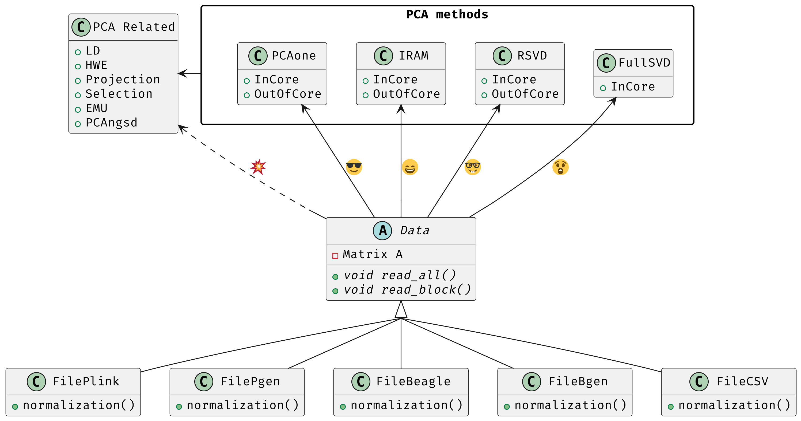
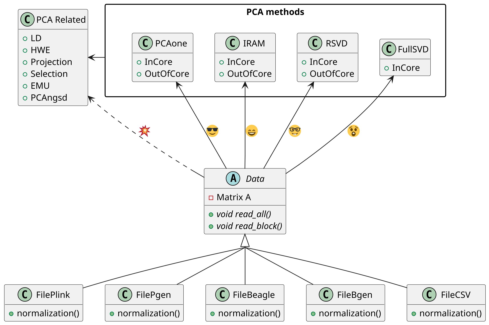

# Architecture

The class diagram above is drawn with [PlantUML](https://plantuml.com) (1.2024.4)
from the source below. To redraw it after editing, run
`plantuml dev/architecture.md`: PlantUML picks up the `@startuml` block in this
file and writes `architecture.png` next to it.

